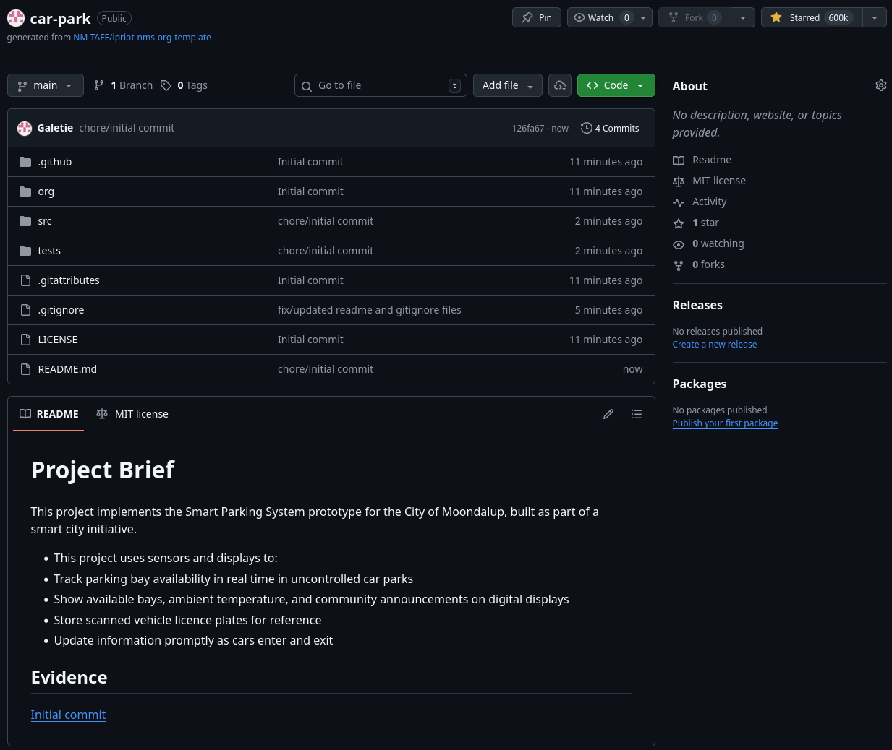
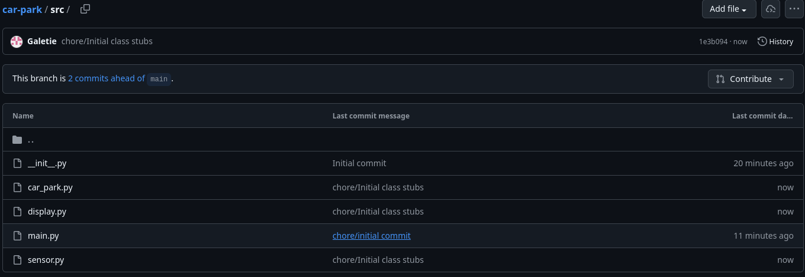
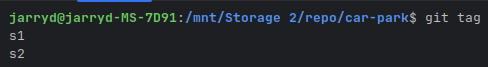
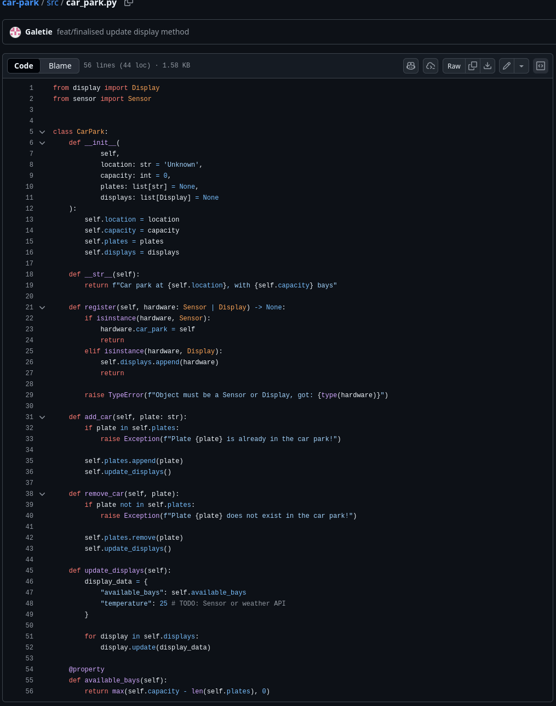
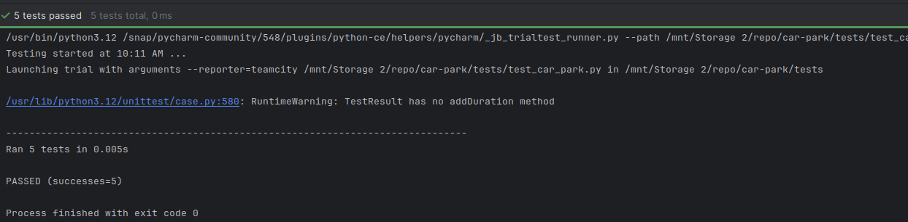
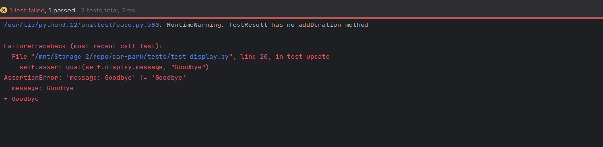
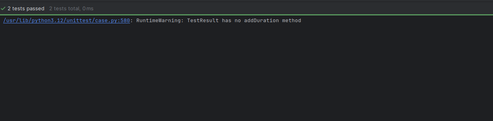
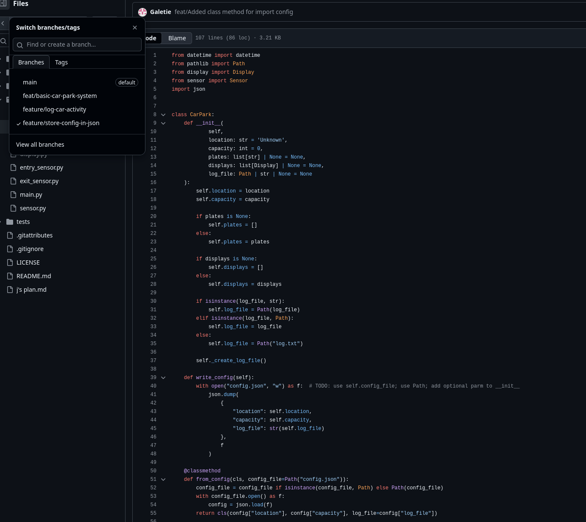

# Project Brief
This project implements the Smart Parking System prototype for the City of Moondalup, built as part of a smart city
initiative.

* This project uses sensors and displays to:
* Track parking bay availability in real time in uncontrolled car parks
* Show available bays, ambient temperature, and community announcements on digital displays
* Store scanned vehicle licence plates for reference
* Update information promptly as cars enter and exit

## Evidence

### 2.3
| Class Name | Attributes | Methods |
|------------|------------|---------|
| CarPark    |            |         |
| Sensor     |            |         |
| Display    |            |         |

### 2.4.3

### 2.5.4

### 2.7.3

> Q: Which class is responsible for the number of available bays (and why)?
> The CarPark class should manage the information displayed by the displays. The Display class should only be
> responsible for displaying information, not deciding what to display. This avoids the displays showing different
> information as they would need to decide when to fetch data from the CarPark and other APIs such as a weather API
> in order to display information. Whereas the CarPark can signal to the displays when to update when a change occurs.
> 
> Q: Which class is responsible for the current temperature (and why)?
> None of the classes are responsible for this. A new class implementing a weather or temp sensor should be implemented
> instead, depending on the CTO's requirements.
> 
> Q: Which class is responsible for the time (and why)?
> None of the classes are responsible for the time, however, python has an inbuilt datetime which can provide the
> current time. So the class responsible for what is displayed (CarPark), can and should call this when determining what
> to display

> Q1: Which class is responsible for each of the following pieces of information (and why)?
>  * The number of available bays
>    * The CarPark class, which keeps count via the available_bays property
>  * The current temperature
>    * The CarPark class currently, as a hardcoded value
>  * The time
>    * None of them, but I suppose I'll go implement that now, and it'll be the CarPark class
> 
> Q2: What is the difference between an attribute and a property
> A property is an interface to a value or attribute of an object. eg the available bays' property.
> A attribute is just a value belonging to a class or object, such as the plates or displays.
> 
> Q3: Why do you think we used a dictionary to hold the data we passed the display? List at least one advantage 
> and one disadvantage of this approach.
> Use of a dictionary allows us to easily define the data to display, associated with a key. This covers the /what/ to
> display, and leaves the display responsible for /how/ to display the information

> Q: The car park register method should accept a Sensor (optional) or Display object. It should raise a TypeError if 
> the object is neither a Sensor nor a Display. Before proceeding, think about where you would test this behaviour. 
> Should you test it in the CarPark unit tests or the Display/Sensor unit tests? Why?
> You should test in the CarPark unit test, as we are testing the method of the CarPark. It is ultimately the 
> responsibility of the CarPark to test the validity.

## 3.1
